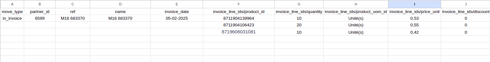
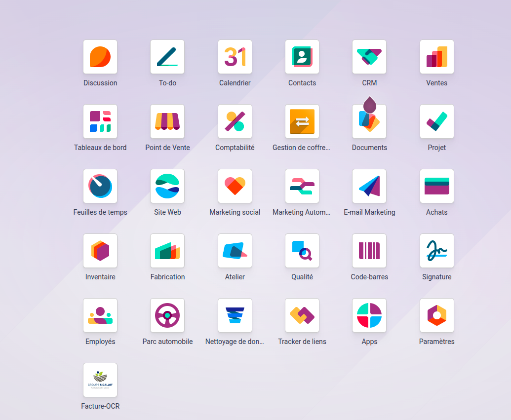
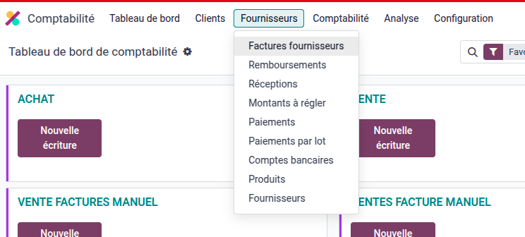
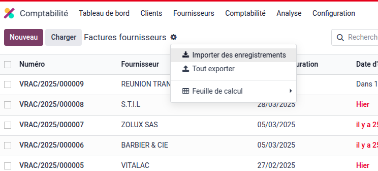
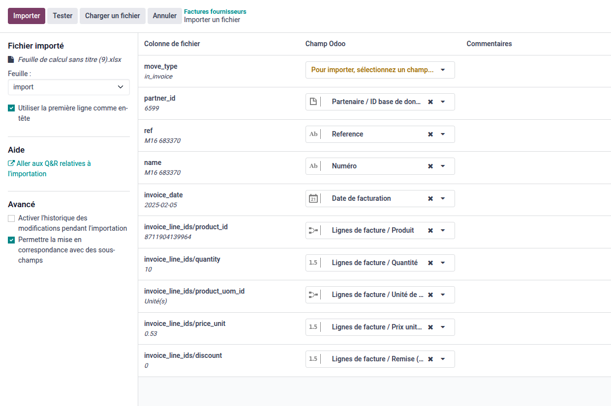
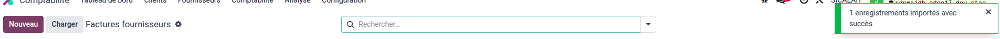
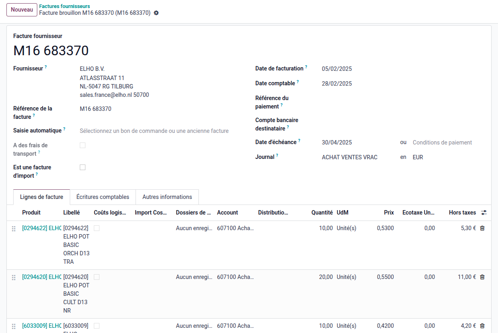

# Procédure d'Importation de Factures dans Odoo 17

## 🔖 Objectif
Importer manuellement des factures dans Odoo à partir d'un fichier Excel (.xlsx), en respectant la structure attendue par Odoo.

Cette procédure inclut :
- La préparation d'un fichier Excel au bon format
- L'importation manuelle dans l'application Comptabilité
- La validation des factures créées

## 🔢 Pré-requis
- Accès utilisateur Odoo avec les droits "Comptabilité"
- Fichier Excel préparé avec les champs requis
- Module "Comptabilité" installé dans Odoo

## 🔹 Étape 1 : Préparer votre fichier Excel

### Format du fichier
Le fichier doit contenir les colonnes suivantes :

| Champ Excel | Description | Exemple |
|:------------|:------------|:--------|
| move_type | Type de facture | out_invoice (client), in_invoice (fournisseur) |
| partner_id/id | Partenaire / ID base de données | 123 ou res.partner_demo |
| ref | Référence facture externe | FACT-00123 |
| name | Référence facture externe | FACT-00123 |
| invoice_date | Date de la facture | 2025-04-01 |
| invoice_line_ids/product_id/id | CODE BARRE EAN ou External ID du produit | 456 ou product.product_demo |
| invoice_line_ids/quantity | Quantité facturée | 120 |
| invoice_line_ids/product_uom_id | UDM | Unité(s) |
| invoice_line_ids/price_unit | Prix unitaire Brut | 100.00 |
| invoice_line_ids/discount | Prix unitaire Brut | 100.00 |

### Exemple de fichier Excel

*Vue générale de l'interface Excel pour import facture Odoo 17*

## 🔹 Étape 2 : Accéder à l'importation dans Odoo

1. Connectez-vous à votre Odoo
2. Allez dans **Applications** > **Comptabilité** > **Fournisseurs** > **Factures fournisseurs**
3. Cliquez sur la roue dentée ★ en haut à gauche (menu **Actions**)
4. Sélectionnez **Importer des enregistrements**

*Vue générale de l'interface Excel pour import facture Odoo 17*

*Vue générale de l'interface Excel pour import facture Odoo 17*

*Vue générale de l'interface Excel pour import facture Odoo 17*

## 🔹 Étape 3 : Charger votre fichier Excel

1. Cliquez sur **Charger un fichier**
2. Sélectionnez votre fichier Excel
3. Laissez Odoo analyser les colonnes
4. Vérifiez la correspondance automatique des colonnes
   - Exemple : "partner_id/id" doit correspondre à "Client"

*Vue générale de l'interface Excel pour import facture Odoo 17*

## 🔹 Étape 4 : Lancer l'importation

1. Après avoir validé le mapping, cliquez sur **Importer**
2. Odoo affiche un message de confirmation
3. Vos factures sont maintenant créées en mode **Brouillon**

*Vue générale de l'interface Excel pour import facture Odoo 17*

*Vue générale de l'interface Excel pour import facture Odoo 17*

## 🔹 Étape 5 : Valider les factures

1. Ouvrez chaque facture nouvellement créée
2. Contrôlez les données (client, date, produits, montants, taxes)
3. Cliquez sur **Valider** pour officialiser la facture

## 🌟 Conseils pratiques

- Utilisez des **External IDs** pour les produits et clients si possible, c'est plus sûr.
- Assurez-vous que les produits existent dans Odoo avant d'importer.
- Faites un **test** avec 1 ou 2 factures avant d'importer 100+ factures !
- Sauvegardez toujours votre fichier Excel avant un import.

---

# 📄 Fichier Excel modèle prêt à l'emploi

- Un fichier `exemple.xlsx` est fourni pour vous aider à structurer vos données.
- Remplissez simplement les colonnes et suivez cette procédure.

---

**Procédure rédigée par [Jimmy CHABOT]**

Dernière mise à jour : Avril 2025

